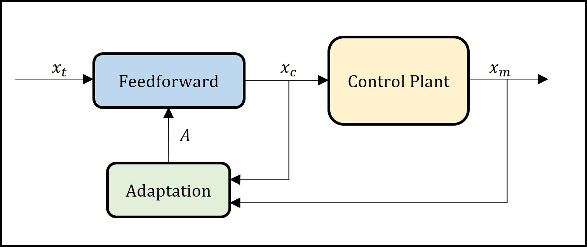

# Robust adaptive model-based compensator for the real-time hybrid simulation benchmark

## Description

This repository contains the source code and data generated in the publication:

- Cristobal Galmez and Gaston Fermandois (2022). "Robust adaptive model-based compensator for the real-time hybrid simulation benchmark." (Submitted for publication in *Structural Control and Health Monitoring*.) 

The Adaptive model-based compensator (AMB) consists in the inverse of the control plant in continuous form, but implemented with finite difference to achieve a causal controller. The AMB utilizes gradient adaptive law to identify the control plant model parameters and therefore requires the calibration of an adaptive gain matrix $`\Gamma`$.

## Requirements

- Matlab R2021a or superior

## Folders description

A brief description of each application is presented and description of each file and instructions to execute are provided in the readme file inside the respective folders.

### 1. AMB_Linear

In this example the adaptive model-based compensator is designed, calibrated and applied to the RTHS benchmark. A calibrated gain matrix Gamma is provided to run several simulations with linear systems includding uncertainty. However, the adaptive gain matrix Gamma can be recalculated and analized using the calibration procedure.

### 2. AMB_NonLinear 

In this example the adaptive mode-based compensator is applied to a modification of the RTHS benchmark, where the linear experimental substructure is replaced by non-linear models. Modified Bouc-Wen models are utilized to consider hysteretic models with degradation. This example does not include gains calibration since the goal is to prove the gains obtained for the linear case.
